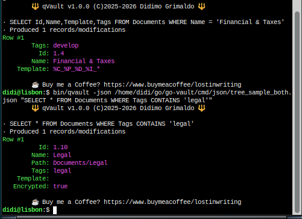

# QVAULT - SQL-like queries for your Vault

This is an auxillary executable that allows the user to do free-form
SQL-like queries on the command line. It uses your logical folder structure
which is contained in one or more configuration files. This logical structure
is reflected on the physical file system.

At this moment it has full `SELECT` support and partial `UPDATE` support. The
update is not completed because it needs to be persisted.

Here are some examples of FQL (Folder Query Language) statements:

* `SELECT Name,Path FROM Pictures WHERE Encrypted = true`
* `SELECT Id,Name,Path FROM Documents WHERE Path LIKE 'Documents/Legal/%'`
* `SELECT Name,Tags FROM Pictures WHERE * LIKE '%Project%'`
* `SELECT * FROM Documents WHERE Name LIKE '%Munich%'`
* `UPDATE folders SET Name = 'Archived' WHERE Id = '1.2'`
* `UPDATE folders SET Encrypted = false, Tags = 'public' WHERE Name = 'Public Docs'`

In the `SELECT` clause you can use any of the `Folder` field names: `Id, Name, Path, Tags, Template` or the `*` character to select *all* fields.

The `FROM` clause indicates the name of the *top root node* as specified in your
source JSON file that contains the File Directory Structure that is replicated on
the physical file system. You can have one file for Documents and another for 
Pictures or both together, so there is no limitation of the number of top root nodes.
The logical structure is hiearchical, as in a tree.

The `WHERE` clause has built-in operators like `=`, `CONTAINS` and `LIKE`. The 1st
argument in the `WHERE` clause is the field to examine, or you can use `*` to specify
that it look at `Name, Path, Id, Tags` for the match. 

The `LIKE` operator works like in SQL, so you can use `_` to signify a single
character or `%` to signify several characters.

***
Copyright &copy;2025-2026 Lord of Scripts™ 
