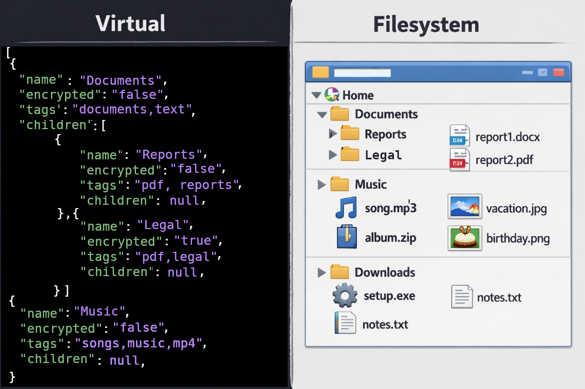

# Go Vault Recipes

> *An organized, queryable Go-powered document repository management tool.*

Here are some recipes for success using the `govault` included in this module.
If you tried help you know that the first parameter indicates the command
(without dash), followed by one or more dashed command-line options.

* [Help](#help-command) Help about using it from the CLI
* [Create](#create-command) replication of filesystem
* [Update](#update-command) update of filesystem after updating Virtual JSON file
* [Synchronization](#synchronization) of Virtual <-> Storage
* [List](#list-commmand) Displays hieararchy of Virtual JSON structure
* [Tags](#tags-commmand) Displays or queries the Tag metadata
* [Template](#template-commmand) Using filename templates

Other things you should know to master `GoVault`:

* [Template](#template-commmand) Using filename templates
* [Configuration](#configuration) Virtual structure configuration files

## Common Concepts

### Paths to the Virtual Directory Structure templates

Several commands accept the `-json string` command-line option to indicate the
location of the JSON file containing the *virtual* directory ('folder' in Windows)
structure. 

The `string` value can be a full path to a `.json` file, or alternatively
(recommended) you can have your own customized virtual directory structures for
both **Documents** (`govault_docs.json`) and **Pictures** (`govault_pics.json`) 
in your *configuration*  directory.

In order to ease working with the tool, the `-json` option accepts *short-form* 
versions that are internally translated to the actual configuration filenames/path:

* `app:docs` represents the `govault_docs.json` configuration file that lists your
  *Document* folders (one or more) with their sub-folders. The default version lists
  a single `Documents` root folder. But you can add extra root nodes for `Backup` or
  whatever you use for other document folders that you wish to standarize across
  systems.
* `app:pics` represents the `govault_pics.json` configuration file  that lists your
  *Picture/Image* folders (one or more) with their sub-folders. The default version
  lists a single `Pictures` root folder as it is customary on most OS. Make sure
  to customize that configuration file.
* `app:templates` represents the `govault_templates.json` configuration file. It
  is only used to define your *filename template* validators. Remember that each
  (sub)directory/folder in the Documents and Pictures configurations, can specify
  its own filename template.

For a quick overview of your virtual folder structure use the `list` command.

---
## Help Command

Command-Line applications always have a series of optional and compulsory flags.
This application has grouped the functionality in *subcommands*: `help,tags,template,create,update,sync,list`.
The `help` subcommand lets the user ask for more help information about a specific
subcommand, for example:

> `govault help` 

Will display general help about the application, whereas if you want more specifics
about a subcommand, the command is expanded as:

> `govault help tags`

where the first *argument* is the *subcommand* you are interested in finding
more information about.

## Synchronization

First of all, this is **not** a file-level synchronization tool! There are plenty
of great alternatives for that. This is simply a synchronization of directory/folder
structure. For this we have the virtual filesystem structure (left) specified in
a `.json` *configuration* file, and the physical filesystem structure (right) which
is present on a physical disk.

*This command may be catastrophic if you don't put all your senses into what you* 
*are doing or don't know what you are doing!* It may potentially DELETE entire
directory trees if YOU goof up! **USE IT AT YOUR OWN RISK** because 
**I AM NOT LIABLE FOR DATA LOSSES**. Ensure you have backed up before using the
`sync` command.



### Mirror Right

> `govault sync -json app:docs -root . -system -dry`

This command tells the tool uses the `-json FILE` option to point to the 
`govault_docs.json` virtual structure that you customized and kept in 
your configuration directory. Alternatively instead of `app:docs` or `app:pics`
you can point it to a `.json` file elsewhere.

Additionally the `-root .` specifies to base the root of the *comparison* to the
current directory. So, if you are in `$HOME` and your home directory has
this structure:

```
/home/lordofscripts/
├── Backup
├── Documents
└── Pictures
```

and lastly the `-system` option tells that you want *Synchronize Right*,
that is to update the (right) filesystem on disk to the same structure
that appears on the (left) virtual structure. This translates to a
series of `mkdir` (make directory) and `rm` (remove directory) OS commands.

Now, the sample *virtual* `app:docs` JSON file lists only lists `Documents`
as top-root node. Does that mean that the `sync -system` would remove my
`Backup` and `Pictures` directories (recursively) because they do not appear
on the JSON file? the answer is **NO**. That command will only do matches
or comparisons on the filesystem directories underneath `-root PATH` PATH
whose *path* begins with any of the root virtual folders, in this case
`Documents` so the other two get ignored.

Yes! I included the `-dry` option as a safeguard so that it only says what
it will create or delete without actually doing it. Make it a habit to first
try the *dry run* unless you have backed up your data!!! **I AM NOT RESPONSIBLE
FOR DATA LOSS** 

**WARNING** Because this command permanently erases directories, make sure
you first use the `-dry` option!!!

### Mirror Left

> `govault sync -json app:pics -root . -virtual -dry`

The *virtual sync* command does the opposite of the previous command. It reads the
structure of subdirectories *under* `-root`, then from the resulting list of subdirectories,
it will weed out all whose path do not begin with any of the *top-level names* in the
virtual file listing "folders". For those directories that match, it will recurse them
to inspect which **new** directories are present in the filesystem that are not in the
*top-level* nodes of the virtual file.

Example: *Your virtual (JSON) file describes this structure for your document repository:*

```
/home/lordofscripts/
└── Documentos
    ├── One
    │   └── B
    │       └── C
    └── Two
        └── A
```

And your file system under the *top-level node* `Documentos` shows
the following structure (like the `tree -d DIRECTORY` Linux/Unix command):

```
/home/lordofscripts/
└── Documentos
    ├── One
    │   └── B
    │       └── C
    ├── Three
    │   └── X
    │       └── Y
    └── Two
        └── A
```

The command will detect that your actual document repository has a whole subtree
named `Documentos/Three' and add it recursively (`X` and `X/Y` included) to your
Virtual JSON file.

**WARNING** Because this command does NOT erase files or directories, but without
`-dry` it will overwrite the file pointed by the `-json` parameter!


## List Commmand

Oftentime you will need to get a quick overview of the virtual folder
structure that is used to create physical disk structures. You can do
that for your `app:docs`, `app:pics` or any *Folder* JSON file:

> `govault list -json app:docs`
> `govault list -json ~/.config/coralys/govault/govault_custom.json`

The command will dump the structure of the Virtual filesystem template
listing the depth level (000 being top-level) and the basename. It would
look like this:

```
000 Documents
001     Admin
002         Laptop
002         PC
001     Archive
001     Development
001     Financial & Taxes
002         NL
002         US
001     Medical
001     Hobbies
001     Housing & Property
002         Utility-Bills
001     Insurance
001     Retirement
001     Legal
002         Business
002         Certificates
002         Citizenship
001     Library
001     People
001     Projects & Ideas
001     Reports
001     Templates
001     Travel
001     Vehicle
002         Maintenance
002         Registration
```

## Tags Command

Go Vault lets you associate tag metadata to your directory hieararchy. You will
no longer be storing documents or pictures wherever you first it sees fit,
only to realize you already had a dedicated directory for that category.

### Tag Cloud : Know what you have

Do you need a quick overview of which tags you have already defined in your
virtual file structure? This will help you refine it (edit separately)

> `govault tags -json app:pics -list`

The `tags` subcommand with the `-list` option will display your *Tag Cloud* for the
virtual structure declared in the file pointed by `-json`. Here is an example of
how it could look like:

```
	🔱 goVault v1.1.0-RC.2 (C)2025-2026 Didimo Grimaldo 🔱
	 ⎍⎍⎍⎍⎍⎍⎍⎍⎍⎍⎍⎍⎍⎍⎍⎍⎍⎍⎍⎍⎍⎍⎍⎍⎍⎍⎍⎍⎍⎍⎍⎍⎍⎍⎍⎍⎍⎍⎍⎍⎍⎍⎍⎍⎍⎍⎍⎍⎍⎍⎍⎍

Tag Cloud
                 all (1)            business (1)           documents (1)
              family (1)           genealogy (1)            graphics (1)
               hobby (2)                home (1)               house (1)
               icons (1)              income (1)               legal (1)
                logo (1)               novel (1)           ownership (1)
              payhip (1)              people (1)              photos (1)
           portraits (1)               press (1)             private (1)
            projects (1)            property (1)         screenshots (1)
              secret (1)              social (1)            template (1)
        unclassified (1)          wallpapers (1)              webcam (1)
            websites (1)             writing (1)
	☕ Buy me a Coffee? https://www.buymeacoffee/lostinwriting
```

Tags can be inherited by subdirectories. The Tag Cloud will list each of
the unique tags that you defined to categorize your files, and how many
(sub)directories match that tag. Now you know whether you already have
a place for it, or whether you should edit the Virtual JSON file to add
a new tag.

Once you know you already have a classification in place, you want to
know **where** to story them. GoVault helps you further in organizing
your files!

### Tag Query : Know the best place to store

Before `goVault` whenever you got a new document or picture, you archived it in
the first directory you thought it fit, or just left it unclassified. Later you
realized you had a deeper subdirectory for that type of document or pictures! 
After some time your entire file system was a disorganized mess!

> `govault tags -json app:pics -query "christmas, office"

Say you got a bunch of new pictures of your corporate Christmas party. You
don't want to explore the filesystem to find where to put them, and you
don't want to drop them anywere.

With the `tags` subcommand and the `-query` option, you can specify one or more
(quoted as a single string) tags that would help you classify the new batch
of files. The output of this command. Here is an example of the output:

```
Query Tags: genealogy, portraits
	Photos/Genealogy     00   T tags: all,family,genealogy,hobby,photos
	Photos/People        00   T tags: all,people,photos,portraits

	☕ Buy me a Coffee? https://www.buymeacoffee/lostinwriting
```

The output will list one line for every (sub)directory that fulfills your
Tag Query. The 1st column is the subdirectory in your real filesystem,
followed by how many subdirectories it contains, a descriptor of which
metadata attributes are associated to that directory (`T` means it has a
filename template defined, `E` for encrypted contents), and the last column
lists all the (inherited) tags that apply to that (sub)directory.

## Create Command

Once you gave serious thought to HOW you want to organize your Documents, Pictures
and others, the first thing you do is to *edit* the corresponding JSON (Virtual)
file. Let's assume you already have that in place, and you should!

The `create` subcommand would be instrumental in being able to replicate that same
structure on every computing device (PC, Laptop, Mobile phone, NAS disk, etc.) 
without the *absolutely tedious*  and old-fashioned way of manually creating and 
deleting directories (or creating a ZIP file with that structure that might change).

> `govault create [-perm OCTAL] -root ~/ -json app:docs`

As usual, you must specify the source JSON file that describes your virtual
structure. The `-root` option specifies the root directory under which the
*top-level* hierarchies of Virtual will be recreated on disk. You may specify
the (octal) permissions to be given to the directories that are created.


## Update Command

There will come the time where you have revised your Virtual structure 
(the JSON file in case you forgot) and want to ensure your filesystem
resembles exactly that virtual structure.

> `govault update [-perm OCTAL] -root ~/ -json app:docs`

The `update` subcommand will do just that, replicate (by updating) your
JSON virtual structure on the filesystem.

**NOTE:** *As of the time of this writing, it does NOT flag superfluous
directories not found on the JSON file that are present as extra on the
filesystem*. See [Issue #5](https://github.com/lordofscripts/govault/issues/5).


## Template command

A new feature in the Virtual structure is that there is a JSON field for
folder/directory metadata. The `template` metadata file is optional, and
if it has a value, it is a *filename template* that specifies the
suggested (or required if you will) template that would dictate the
*names of the files* in that directory. This is extremely useful for
archival of legal or legacy documents, as well as for pictures.

GoVault already comes with some predefined template tokens such as
*date, image extension* but you can define your own tokens. These
could be lists of values (usually abbreviations) or even *Regular Expressions*.
There is a separate configuration file `govault_templates.json` file that
you should customize for your archival system.

> `govault help template`

```
lordofscripts@munich$ govault  template {Option}
Option:
	-rules   List defined Template Rules
	-tokens  List defined Template Tokens
	-check	Check filenames for template conformance
	-r		Recursive verification (-check)
```

First ensure you have customized the Template configuration to
your liking or requirements.

> `govault template -check [-r] -json app:docs -root ~/`

This `template` subcommand would check filename name conformance
as per your tokens and rules. It will output a summary of files
that whose name are an eyesore.

> `govault template -tokens`

This subcommand with the `-tokens` flag will output a (probably long)
all the **Template Tokens** you have defined in `govault_template.json`.
For example:

```
Token %C (Country)
       Value Description
         PAN Panamá
         NLD Holanda
         USA Estados Unidos de America
Token %H (Medical Institution)
       Value Description
         HAC Hospital ACME
         ASL ACME Specialized Laboratory
Token %M (Medical Specialists)
       Value Description
        DIAG Diagnostic or Reference
          RX Medical Prescription
        CARD Cardiology
        ENDO Endocrinology         
```

So, if you defined the `template` attribute for your `Documents/Health`
as `$R2_%H_%M_%D_*` then you should name your files like this:
`LVB_HAC_DIAG_20251231_something.pdf, RVB_ASL_ENDO_20240507_hormones.pdf` and
so on. You can mix tokens and rules in the same template. In the template
example `$R2` points to *Rule #2* from the next subsection "Family Brothers".

> `govault template -rules`

This subcommand with the `-rules` flag will output a (probably long)
all the **Template Rules** you have defined in `govault_template.json`.
Rules are like tokens, except they are referenced in the *template* with
the `$` prefix instead of `%` prefix.
For example:

```
	🔱 goVault v1.1.0-RC.2 (C)2025-2026 Didimo Grimaldo 🔱
	 ⎍⎍⎍⎍⎍⎍⎍⎍⎍⎍⎍⎍⎍⎍⎍⎍⎍⎍⎍⎍⎍⎍⎍⎍⎍⎍⎍⎍⎍⎍⎍⎍⎍⎍⎍⎍⎍⎍⎍⎍⎍⎍⎍⎍⎍⎍⎍⎍⎍⎍⎍⎍

	Rules:
                         Title (Token) Rule
                    Properties ($R1) ^P\d{6,8}(?:-\d{4})?$
               Family Brothers ($R2) LVB|VVB|RVB
                Family Sisters ($R3) EVB|CVB
```

#### Filename Template Examples

Usually the pictures from your devices have a specific filename that follows a
pattern like `IMG_20261025_230015.jpg`. Or perhaps you want (recommended!) to
organize your *Digital Legacy* with well-formed names that identify owners,
institutions, categories or whatever.

For that, as of `goVault v1.1.0` you can specify filename templates in your
*directory hiearchy* JSON files. The `govault_pics.json` and `govault_docs.json`
files in your configuration directory are a good start, feel free to customize
them to your own hierarchy.

The templates you *optionally* specify in the two config files just mentioned
could look like `IMG_%D_%T*.%X` (example for images) so that you can validate 
compliance of your filenames with the suggested template. This highly flexible 
system uses **Tokens** that you define in the `govault_templates.json` 
configuration file. There you define Predefined tokens as a list of  *key-value* 
pairs (valid name and description), a list of values (`IMG|PIC|DCIM`) or
even *Regular Expression* Rules for more complex variations. You can examine
a [sample template](../cmd/json/empty_template.json). I have found this
very valuable for both my Document and Picture vaults where my family (or survivors)
can quickly identify the relevance of files. Obviously, very helpful for me
as well.

# Configuration

The first time you execute `govault` it will create sample configuration
files `govault_docs.json`, `govault_pics.json` and `govault_templates.json`.
Please ensure you *edit & customize* these files to suit your vault or 
document repository organization.

The configuration files are found in a *configuration* directory whose
location depends on which OS you are running the application:

* Linux & Unix: `~/.config/coralys/govault/` 
* MacOS: `~/Library/Application Support/coralys/govault/`
* Windows: `~/AppData/coralys/govault/`

You noticed many of the *subcommands* take a `-json PATH` flag that 
instructs the application *where* to find the configuration file
of Virtual structure (pics, docs) or Template (template). Sometimes
you may wish to use a temporary file; however, most of the times you
would use those you already customized for replication that are in
the *configuration directory*. 

It can be cumbersome to always type the entire path to those 
configuration files. Sometimes you may not even remember, for example
if you switch between systems. For that, the GoVault applications
allow you to use a shortcut (a short name) that internally expands
to the actual filename in the configuration directory. These are
the shortcuts you can use with the `-json` flag:

* `-json app:docs` refers to the `govault_docs.json` file
* `-json app:pics` refers to the `govault_pics.json` file
* `-json app:templates` refers to the `govault_templates.json` file

Ensure you use an online JSON validator like [JSON Lint](https://jsonlint.com/)
or any that suits you. If you use an incorrect JSON syntax none of
the applications will work and it is YOUR fault.

The fields in the JSON configuration files are self-explanatory.

***
Copyright &copy;2025-2026 Lord of Scripts™ 
